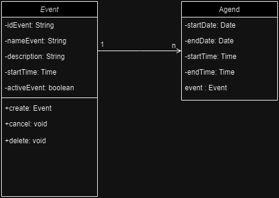

# Zup Agend


-------
## UML of project



## API Contract

Add new event
POST /event
```json
{
  "startDate": "2024-10-09",
  "endDate": "2024-10-09",
  "startTime": "09:00:00",
  "endTime": "09:30:00",
  "eventDTO":{
    "nameEvent": "teste 2",
    "description": "teste de post 2"
  }
}
```
Cancel event
Put /event
```json

```